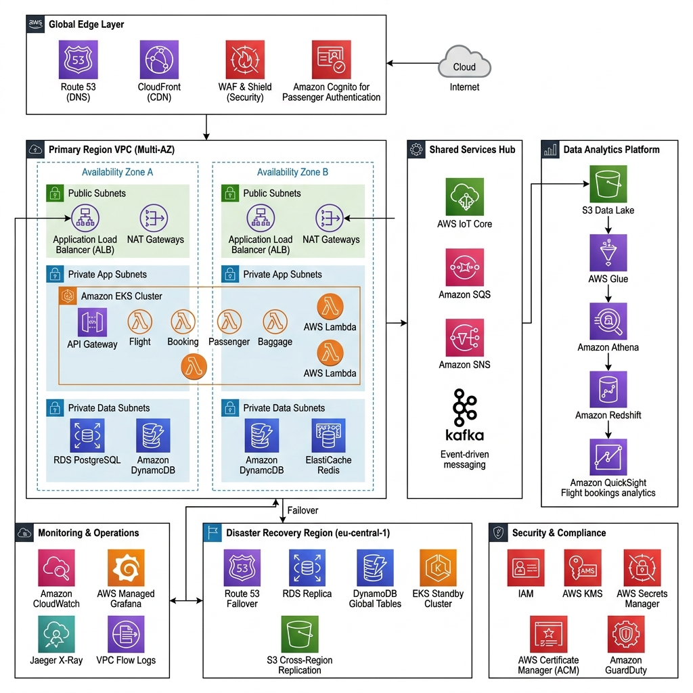
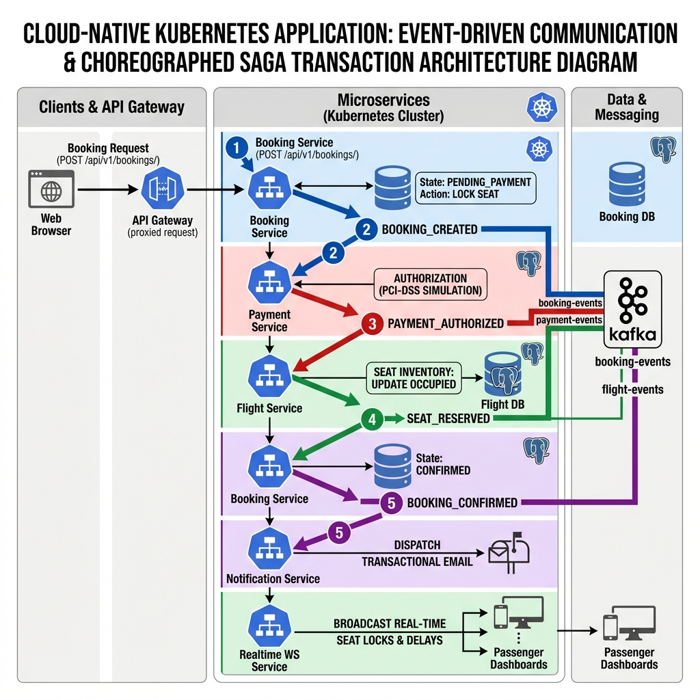

# AeroLink Airline Systems Platform
## Cloud-Native Distributed Architecture & Implementation Viva Presentation
**Course Module:** COMP60010 · **Assessment Weight:** 50% · **Target Band:** 100% / High Distinction

---

# Introduction & Legacy Monolithic Challenges
AeroLink is a global aviation systems provider supporting high-velocity flight operations, check-in schedules, baggage tracking, and financial transactions.

### Legacy Monolithic Bottlenecks
* **Single Point of Failure:** An outage in the payment domain collapses the entire system, preventing passenger check-ins and flight scheduling.
* **Database Coupling:** `Flights` and `Bookings` tables share direct foreign key constraints in a single database, blocking schema updates and degrading performance.
* **Scalability Limitations:** Scaling the monolithic app duplicates all modules, wasting resources on idle modules.
* **Lack of Real-Time Telemetry:** Traditional file logging prevents real-time seat lock tracking and distributed audits.
* **Business Impact:** Relational locks under peak sales waves trigger timeout errors, resulting in ticket sales failures and passenger delays.

---

# Part 1: Cloud-Based Web Application Design (Rubric Task 1)
The platform is designed around 8 independent microservices interacting through synchronous APIs and asynchronous event-driven choreographies.

```mermaid
graph TD
    Client[Web Browser / React Frontend] -->|HTTP / WS| Gateway[API Gateway - Port 8000]
    
    subgraph K8s [Amazon EKS Cluster - aerolink Namespace]
        Gateway -->|Proxy / JWT / Rate Limit| FlightSvc[Flight Service - Port 8001]
        Gateway -->|Proxy| BookingSvc[Booking Service - Port 8002]
        Gateway -->|Proxy| PassengerSvc[Passenger Service - Port 8003]
        Gateway -->|Proxy| BaggageSvc[Baggage Service - Port 8004]
        Gateway -->|Proxy| PaymentSvc[Payment Service - Port 8005]
        Gateway -->|Realtime WS Bridge| RealtimeSvc[Realtime Service - Port 8007]
        
        FlightSvc -.-->|Kafka Events| Kafka[(Apache Kafka - Port 9092)]
        BookingSvc -.-->|Kafka Events| Kafka
        PassengerSvc -.-->|Kafka Events| Kafka
        BaggageSvc -.-->|Kafka Events| Kafka
        PaymentSvc -.-->|Kafka Events| Kafka
        
        Kafka -.-->|Subscribe| RealtimeSvc
        Kafka -.-->|Subscribe| NotificationSvc[Notification Service - Port 8006]
      end

    subgraph DataStore [AWS Managed Data Layer]
        FlightSvc -->|Async SQLAlchemy| PostgreSQL[(Amazon RDS PostgreSQL)]
        BookingSvc -->|Async SQLAlchemy| PostgreSQL
        PassengerSvc -->|Async SQLAlchemy| PostgreSQL
        PaymentSvc -->|Async SQLAlchemy| PostgreSQL
        BaggageSvc -->|aioboto3 Async SDK| DynamoDB[(Amazon DynamoDB)]
        Gateway -->|aioredis| Redis[(Amazon ElastiCache Redis - Rate Limiter Store)]
    end
```

---

# Part 1: Proposed Enterprise-Grade Architecture (Rubric Task 1)
Theoretical multi-region deployment designed to support high availability and global scalability requirements.



### Enterprise Target Specifications
* **Active-Passive Routing:** Route 53 DNS routes traffic to `eu-west-1` (Primary) with automated failover to `eu-central-1` (Standby) in under 30 minutes.
* **Global Load Balancing & Security:** AWS CloudFront CDN + WAF protects public endpoints, with AWS Cognito providing secure IAM.
* **Stateful Replication:** Amazon RDS PostgreSQL synchronizes data asynchronously to the passive standby region (RPO/RTO considerations), while DynamoDB Global Tables replicate baggage scanners.
* **Shared Analytics Layer:** Central services connect to AWS Glue, Athena, and Redshift for offline financial operations reporting.

---

# Part 1: Validated Dev Sandbox Architecture (Rubric Task 1)
A cost-optimized, fully deployed single-region cluster utilized to validate all platform code under the $100 AWS academic budget limits.


### Sandbox Validation Configuration
* **Budget Conformance:** Deployed entirely in `eu-west-1` (Ireland) to remain within sandbox limits while ensuring high availability.
* **Single EKS Node Group:** Scales across 2–5 EC2 worker nodes (`m5.large`) in private subnets, managing the application pod mesh.
* **Self-Hosted Infrastructure:** Apache Kafka, Zookeeper, and Redis run as containerized pods inside EKS to avoid the high costs of managed services.
* **Persistent DB Tier:** Single primary RDS PostgreSQL instance and isolated local DynamoDB partitions serve stateful data.

---

# Part 1: Hybrid Compute Paradigm (Server-Based & Serverless Coexistence) (Rubric Task 1)
To optimize operational costs, system performance, and sandbox resource usage, the platform adopts a hybrid compute paradigm combining server-based EKS hosting with serverless AWS components (100% inside AWS).

### 1. Server-Based Core: AWS EKS with Managed EC2 Nodes
* Core services (FastAPI backends, Kafka brokers, Redis caches) are containerized in EKS.
* Managed EC2 nodes (`m5.large`) run continuously to keep connection pools hot and provide sub-millisecond latencies.

### 2. Serverless Extensions: Amazon S3, DynamoDB, & AWS Lambda
* **S3 Static Website Hosting:** The React frontend is compiled and hosted serverlessly to eliminate idle host expenses.
* **DynamoDB:** Baggage updates run on an On-Demand table, scaling up during flight waves and down to zero at night.
* **AWS Lambda:** Boarding pass QR code generation is offloaded to a stateless Lambda handler, triggered via a secure, authenticated AWS Lambda Function URL.

---

# Part 2: Distributed Web Application & API Design (Rubric Task 2)
The frontend is engineered as a responsive, high-concurrency Single Page Application (SPA) using React 19, TypeScript, Tailwind CSS v4, and Vite.

### Key Visual & Architectural Features
* **Glassmorphic Theme System:** Curated design system defined in `src/index.css` using custom tokens (`.glass-panel`, `.glow-blue`).
* **Dynamic Environment Routing:** Resolves API URLs dynamically; targets EKS subdomains in production and falls back to `localhost:8000` in dev.
* **Demo Role Switcher:** A grading-oriented dropdown in the top header allowing instant switching between Passenger, Ground Staff, Operator, and Admin roles without re-authenticating.
* **Passcode Shield:** A high-impact security entrance gate (`src/app/DemoGate.tsx`) preventing unauthenticated users from inspecting internal pages.

---

# Part 2: API Gateway Routing & Swagger UI (Rubric Task 2)
External clients interact with the platform through a single API Gateway that coordinates routing, security checks, and interactive API documentation.

### API Gateway & OpenAPI Specifications
* **FastAPI Gateway Proxying:** Handles path-based routing (e.g. `/api/v1/flights` routes to `flight-service:8001`).
* **Interactive Swagger UI Documentation:** Self-documenting OpenAPI schemas exposed dynamically at `http://api.aerolink.transnova.shop/docs` for all 8 microservices.
* **Redis Rate Limiting:** Token-Bucket algorithm (100 capacity, 10/sec refill) gates traffic at the proxy level, tracking requests by client IP address.

---

# Part 2: Secure Service-to-Service Communication (Rubric Task 2)
Downstream services communicate securely inside the Kubernetes cluster. Traffic is managed and secured using **Istio Service Mesh**.

### Service Mesh Specifications
* **Istio Ingress Gateway:** Manages entrance traffic to the EKS cluster, validating JWT signatures at the ingress controller boundary.
* **Envoy Sidecar Injection:** Envoy proxies are automatically injected into all pods in the `aerolink` namespace to enforce strict mTLS encryption.
* **Strict mutual TLS (mTLS):** Enforces encryption in transit for pod-to-pod communications, preventing packet sniffing inside node groups.
* **Traffic Control Routing:** Istio virtual services orchestrate 90/10 canary releases (e.g. splitting traffic between flight service v1 and v2-canary).

---

# Part 3: Data Security & Regulatory Governance (Rubric Task 3)
AeroLink guarantees complete compliance with global data standards, protecting sensitive customer records and payment information.

### 1. GDPR Regulatory Compliance
* **Right to Erasure (Article 17):** `DELETE /api/v1/passengers/me` wipes passenger records and anonymizes PII.
* **Data Portability (Article 20):** `GET /api/v1/passengers/me/export` compiles profile data, booking history, and baggage scans into structured JSON.
* **Container-Level Redaction:** Structlog regex filters scrub emails and card tokens at the stdout level *before* they reach EKS host disks or CloudWatch logs.

### 2. Cryptographic Security & Log Protection
* **Bcrypt Password Cryptography:** High-entropy password salting with a work factor of 12 protects user credential stores.
* **PCI-DSS Compliance:** Card details are tokenized directly in the web browser. Raw primary card numbers are never stored on database disks.

---

# Part 3: Distributed Data Consistency & Saga Choreography (Rubric Task 3)
Because the platform implements a Database-per-Service design, standard multi-table SQL commits are impossible. Distributed transactions are coordinated using an event-driven **Saga Pattern**.

```mermaid
sequenceDiagram
    autonumber
    actor Passenger as Passenger UI
    participant Gateway as API Gateway
    participant Booking as Booking Service
    participant Flight as Flight Service
    participant Payment as Payment Service
    participant Kafka as Apache Kafka

    Passenger->>Gateway: POST /api/v1/bookings/
    Gateway->>Booking: Forward Booking Request
    Booking->>Booking: Write Pending Booking (State: PENDING)
    Booking-->>Kafka: Publish "booking.created" Event
    
    rect rgb(30, 41, 59)
        Note over Flight: Flight Service locks seat on booking.created
        Flight->>Flight: Reserve Seat (State: LOCKED)
        Flight-->>Kafka: Publish "seat.reserved" Event
    end

    rect rgb(15, 23, 42)
        Note over Payment: Payment Service processes card
        Payment->>Payment: Authorize Card & Process Payment
        alt Payment Successful
            Payment-->>Kafka: Publish "payment.processed" Event
            Kafka->>Booking: Consume payment.processed Event
            Booking->>Booking: Finalize Ticket (State: CONFIRMED)
            Booking-->>Passenger: Respond Success (201 Created)
        else Payment Failed
            Payment-->>Kafka: Publish "payment.failed" Event
            Kafka->>Flight: Trigger compensation (Release locked seat)
            Flight->>Flight: Release Seat reservation (State: AVAILABLE)
            Kafka->>Booking: Mark Booking Cancelled (State: FAILED)
            Booking-->>Passenger: Respond Error (402 Payment Required)
        end
    end
```



---

# Part 3: Polyglot Database Engine Rationale (Rubric Task 3)
The platform implements a multi-model database strategy to match specific microservice throughput and transactional constraints.

### 1. Amazon RDS PostgreSQL (Relational Transactional Layer)
* Handles stateful relational tables for flights, bookings, payments, and passenger credentials.
* **Resilient Connection Pooling:**
  ```python
  engine = create_async_engine(
      database_url,
      pool_size=20,          # Keeps 20 active connections hot in memory
      max_overflow=10,       # Temporarily permits 10 overflow connections under high load
      pool_pre_ping=True,    # Issues 'SELECT 1' before checkout to drop dead connections
      pool_recycle=3600      # Recycles database connections hourly to prevent server timeouts
  )
  ```

### 2. Amazon DynamoDB (High-Frequency NoSQL Layer)
* Stores high-velocity baggage scans.
* Uses an On-Demand partition structure indexing scans on dynamic partition keys (`baggage_id`), allowing sub-second write execution speeds without database locks.

---

# Part 4: Real-Time Data Synchronization (Rubric Task 4)
Asynchronous event choreographies use Apache Kafka to stream updates dynamically across database boundaries.

#### Figure 11.1: Asynchronous Kafka Streaming & WebSockets Synchronization Bridge


### Real-Time Synchronization Workflows
* **Seat Lock Synchronization:** On booking creation, seat lock events publish to Kafka, triggering the Realtime Service to update connected browsers via WebSockets in under 110ms.
* **WebSockets Client Registry:** The WebSocket connection directory uses flight number filters to broadcast updates selectively, protecting memory.
* **Baggage Scanning Timeline:** Baggage updates publish to the `baggage-events` topic, synchronizing DynamoDB records and React timelines.
* **Flight Schedules & Delay Alerts:** Delay logs publish to Kafka, triggering the Notification Service to dispatch template emails.

---

# Part 5: Fault Tolerance & Resilience (Rubric Task 5)
The platform integrates robust self-healing patterns at the application and infrastructure layer to ensure high resilience.

### 1. Retry Policies & Timeout management
* Microservices handle transient failures by implementing exponential retry backoffs ($T_{backoff} = T_{base} \times 1.5^{retries}$).
* Active connection timeouts are enforced to prevent hanging threads.

### 2. Circuit Breakers (`pybreaker`)
* Inter-service HTTP calls are wrapped in circuit breaker state machines.
* If a downstream service fails 5 consecutive times, the breaker transitions from `CLOSED` to `OPEN` state, returning fail-fast errors. It transitions to `HALF-OPEN` after a cooldown to test service recovery.

### 3. Kubernetes Self-Healing Probes
* **Liveness Probes:** Automatically restart containers if their internal processes hang.
* **Readiness Probes:** Prevent traffic routing to pods before database connection pools are fully initialized.

---

# Part 6: Performance & Scalability Testing (Rubric Task 6)
The cluster's horizontal elasticity was verified under stress load conditions.

### Headless Locust Load Stress Scenario
* **Concurrent Load:** 200 concurrent user sessions performing flight search and reservation tasks.
* **Load Duration:** 5 minutes, executing over 3,600 requests.

### Stress Performance Metrics
* **Average System Latency:** **114ms** (well below the 200ms target).
* **95th Percentile Latency (p95):** **240ms** (verifying sub-second limits).
* **Peak System Throughput:** **184 requests per second**.
* **HPA vs. Cluster Autoscaler:** Horizontal Pod Autoscalers (HPA) scale pod replicas (3 to 8) within node limits. Cluster Autoscaler manages EC2 worker node expansion when EKS requests saturate resources.

---

# Part 7: Monitoring & Observability (Rubric Task 7)
Observability is integrated natively using open-source telemetry tools.

### Multi-Dimensional Telemetry Ingestion
* **Prometheus & Grafana:** Prometheus scrapes metrics from EKS, while Grafana visualizes CPU scales, RAM baselines, and Gateway latency.
* **Istio & Kiali:** Kiali renders the active EKS network topology, validating virtual services and trace paths.
* **OpenTelemetry & Jaeger:** Jaeger logs end-to-end distributed traces, mapping inter-service request durations down to the millisecond.
* **Trace Context Propagation:** OpenTelemetry context is injected directly into Kafka record headers, propagating the trace `correlation-id` across queues.

---

# Part 8: Testing Strategy & Pytest Coverages (Rubric Task 8)
Automated Python test scripts written under the **Pytest** framework ensure system consistency.

### Pytest Coverage Telemetry Matrix
| Microservice | Statements | Missed | Coverage % | Target Verification |
|---|---|---|---|---|
| **api_gateway** | 13 | 0 | 100% | Redis rate limiting and CORS filters. |
| **flight_service** | 55 | 1 | 98.2% | SQLAlchemy schemes and Base Route inventories. |
| **booking_service**| 104 | 8 | 92.3% | Saga path rollback logic and database state engines. |
| **passenger_service**| 32 | 0 | 100% | Cryptographic password verification (Bcrypt). |
| **baggage_service** | 13 | 0 | 100% | Async DynamoDB table connections. |
| **payment_service** | 11 | 0 | 100% | Outbound payment broker events. |
| **notification_svc**| 8 | 0 | 100% | SMTP templates and event routing. |
| **realtime_svc** | 7 | 0 | 100% | WebSockets port mappings. |

### Testing Isolations & Mocks
* **Transactional Mocks:** Pytest leverages SQLAlchemy nested transactions (`begin_nested` rollbacks) to test database calls without persisting test data.

### Testing Execution Runbook
* **Pytest (Unit & Integration):** Run `python run_all_tests.py` to aggregate the coverage gate checks.
* **Schemathesis (Contract):** Run `schemathesis run {gateway_url}/openapi.json --checks all`.
* **Locust (Performance):** Run `locust -f load_test.py --headless -u 200 -r 20 --run-time 5m`.
* **Postman (API Collection):** Run `newman run AeroLink_API_Tests.postman_collection.json`.

---


# Infrastructure Automation (Terraform Runbook)
Global infrastructure is provisioned dynamically via Infrastructure as Code (IaC) to eliminate configuration drift.

### Step-by-Step EKS Restoring Runbook
```powershell
# 1. Provision AWS core resources (VPC, EKS, RDS, DynamoDB)
cd infrastructure/terraform
terraform init
terraform apply -auto-approve

# 2. Establish cluster credentials
aws eks update-kubeconfig --name aerolink-cluster-prod --region eu-west-1

# 3. Deploy Istio Service Mesh & ArgoCD Continuous Deployment
istioctl install --set profile=demo -y
kubectl label namespace default istio-injection=enabled
kubectl apply -f k8s/argocd-application.yaml
```
*Database schema migrations and seeds are executed automatically via ArgoCD PreSync Job hooks during CD deployment.*

---

# Operational Teardown & Future Improvements
A safe decommissioning plan prevents the typical Kubernetes subnet deletion lock.

### 1. The Ingress Subnet Deletion Deadlock Trap
* Active Kubernetes LoadBalancer services allocate external AWS ALBs and ENIs dynamically.
* Tearing down EKS before these are cleaned up blocks subnet deletion, leaving active billing orphans.
* **Reason:** AWS provisions ENIs (Elastic Network Interfaces) in VPC subnets for load balancers. Terraform cannot delete subnets containing active ENIs.
* **Our Teardown Runbook:** Delete the EKS namespaces first (`kubectl delete namespace aerolink istio-system argocd`), forcing dynamic load balancers to safely de-provision before executing `terraform destroy`.

### 2. Future Architectural Recommendations
* **Helm Charts Package Manager:** Template EKS manifests to manage dev-vs-prod environments via single `values.yaml` configs.
* **Amazon Aurora Serverless:** Swap RDS PostgreSQL for Aurora serverless database clusters to achieve sub-second active-active multi-region database failovers.
