# AeroLink Airline Systems Platform
## Cloud-Native Distributed Architecture & Implementation Viva Presentation
**Course Module:** COMP60010 · **Assessment Weight:** 50% · **Target Band:** 100% / High Distinction

---

# Slide 1: Introduction & Monolithic Architectural Challenges
AeroLink is a global aviation systems provider supporting high-velocity flight operations, check-in schedules, baggage tracking, and financial transactions.

### Legacy Monolithic Bottlenecks
* **Single Point of Failure:** An outage in the billing domain collapses flight search operations and airport manifests.
* **Database Coupling:** Shared tables block schema adjustments and create performance degradation under parallel connections.
* **Scalability Limitations:** Scaling requires replicating the entire application, wasting cloud resources and storage.
* **Lack of Real-Time Telemetry:** Monolithic logging files block distributed audit trails and prevent real-time seat lock views.

---

# Slide 2: Core Engineering Aim & Project Deliverables
This project details the complete rehosting of the AeroLink monolith into a production-grade, highly available, microservices-based cloud platform.

### Key Implementation Deliverables
* **Requirement 1:** Serverless global static web hosting with custom subdomain routing.
* **Requirement 2:** EKS container orchestration using managed worker groups.
* **Requirement 3:** Zero-trust mTLS service mesh routing and GDPR regulatory compliance.
* **Requirement 4:** Real-time WebSockets event dispatchers and Apache Kafka streams.
* **Requirement 5:** Self-healing deployments and automated Horizontal Pod Autoscalers.
* **Requirement 6:** Stress-testing validations executing 3,600+ requests.
* **Requirement 7:** OpenTelemetry tracing, Prometheus scraping, and Grafana matrices.
* **Requirement 8:** Automated Pytest coverages and Postman end-to-end collections.

---

# Slide 3: Proposed Cloud-Native Architecture
The system transitions to a clean **Database-per-Service** design, isolating bounded contexts and decoupling operations via event choreography.

```mermaid
graph TD
    Client[Web Browser / React Frontend] -->|HTTP / WS| Gateway[API Gateway - Port 8000]
    
    subgraph K8s [Amazon EKS Cluster - aerolink Namespace]
        Gateway -->|Proxy / JWT / Rate Limit| FlightSvc[Flight Service - Port 8001]
        Gateway -->|Proxy| BookingSvc[Booking Service - Port 8002]
        Gateway -->|Proxy| PassengerSvc[Passenger Service - Port 8003]
        Gateway -->|Proxy| BaggageSvc[Baggage Service - Port 8004]
        Gateway -->|Proxy| PaymentSvc[Payment Service - Port 8005]
        Gateway -->|Realtime WS Bridge| RealtimeSvc[Realtime Service - Port 8007]
        
        FlightSvc -.-->|Kafka Events| Kafka[(Apache Kafka - Port 9092)]
        BookingSvc -.-->|Kafka Events| Kafka
        PassengerSvc -.-->|Kafka Events| Kafka
        BaggageSvc -.-->|Kafka Events| Kafka
        PaymentSvc -.-->|Kafka Events| Kafka
        
        Kafka -.-->|Subscribe| RealtimeSvc
        Kafka -.-->|Subscribe| NotificationSvc[Notification Service - Port 8006]
      end

    subgraph DataStore [AWS Managed Data Layer]
        FlightSvc -->|Async SQLAlchemy| PostgreSQL[(Amazon RDS PostgreSQL)]
        BookingSvc -->|Async SQLAlchemy| PostgreSQL
        PassengerSvc -->|Async SQLAlchemy| PostgreSQL
        PaymentSvc -->|Async SQLAlchemy| PostgreSQL
        BaggageSvc -->|aioboto3 Async SDK| DynamoDB[(Amazon DynamoDB)]
        Gateway -->|aioredis| Redis[(Amazon ElastiCache Redis)]
    end
```

---

# Slide 4: Loose Coupling & Bounded Contexts
Each microservice owns its domain schema, completely eliminating database coupling.

### Microservice Specifications
* **API Gateway:** Reverse proxying, JWT validation, and Redis-backed rate limiting.
* **Flight Service:** Flight inventory scheduling and pricing bounds using RDS PostgreSQL.
* **Booking Service:** Reservation tracking, ticket state machines, and Saga orchestration.
* **Passenger Service:** GDPR rights, user registers, and secure password sessions.
* **Baggage Service:** High-frequency baggage location scans writing directly to serverless DynamoDB.
* **Payment Service:** Payment token authorization auditing under secure PCI-DSS constraints.
* **Notification Service:** Outbound customer email dispatches driven by Kafka event consumption.
* **Realtime Service:** WebSockets connections broadcasting live seat changes.

---

# Slide 5: Hybrid Cloud Compute Topology
To balance operational latencies, compute performance, and cloud budget rules, the platform adopts a hybrid compute model.

### 1. Server-Based Core: AWS EKS with Managed EC2 Nodes
* Core services (FastAPI backends, Kafka brokers, Redis caches) are containerized in EKS.
* Managed EC2 nodes (`m5.large`) run continuously to keep connection pools hot and provide sub-millisecond latencies.

### 2. Serverless Extensions: Amazon S3, DynamoDB, & AWS Lambda
* **S3 Static Website Hosting:** The React frontend is compiled and hosted serverlessly to eliminate idle host expenses.
* **DynamoDB:** Baggage updates run on an On-Demand table, scaling up during flight waves and down to zero at night.
* **AWS Lambda:** Boarding pass QR code generation is offloaded to a stateless Lambda handler, preventing EKS CPU fatigue.

---

# Slide 6: Multi-AZ High Availability & Resilience
The infrastructure is engineered to survive physical datacenter collapses, routing traffic via isolated Multi-AZ network boundaries.


### Multi-Availability Zone Topology
* **Public Ingress Subnets:** AWS Application Load Balancer distributes public HTTPS traffic across availability zones.
* **Private EKS Application Subnets:** Replicas are scheduled across `eu-west-1a` and `eu-west-1b` subnets using PodAntiAffinity constraints.
* **Isolated Database Subnets:** Amazon RDS PostgreSQL master database synchronizes transaction logs in real time to an active-passive standby database in an independent zone.
* **Network Security boundaries:** NAT Gateways route outbound private traffic securely, while EKS endpoints are routed internally.

---

# Slide 7: Enterprise React Frontend Architecture & UI Design
The frontend is engineered as a responsive, high-concurrency Single Page Application (SPA) using React 19, TypeScript, Tailwind CSS v4, and Vite.

### Key Visual & Architectural Features
* **Glassmorphic Theme System:** Curated design system defined in `src/index.css` using custom tokens (`.glass-panel`, `.glow-blue`).
* **Dashboard Shell Layout:** persistent sidebar + header content container. Polls gateway ready states (`/health/ready`) to show cluster health.
* **Demo Role Switcher:** A grading-oriented dropdown in the top header allowing instant switching between Passenger, Ground Staff, Operator, and Admin roles without re-authenticating.
* **Passcode Shield:** A high-impact security entrance gate (`src/app/DemoGate.tsx`) preventing unauthenticated users from inspecting internal pages.

---

# Slide 8: Polyglot Database Architecture & Connection Pooling
The platform implements a multi-model database strategy to match specific microservice throughput and transactional constraints.

### 1. Amazon RDS PostgreSQL (Relational Transactional Layer)
* Handles stateful relational tables for flights, bookings, payments, and passenger credentials.
* **Resilient Connection Pooling:**
  ```python
  engine = create_async_engine(
      database_url,
      pool_size=20,          # Keeps 20 active connections hot in memory
      max_overflow=10,       # Temporarily permits 10 overflow connections under high load
      pool_pre_ping=True,    # Issues 'SELECT 1' before checkout to drop dead connections
      pool_recycle=3600      # Recycles database connections hourly to prevent server timeouts
  )
  ```

### 2. Amazon DynamoDB (High-Frequency NoSQL Layer)
* Stores high-velocity baggage scans.
* Uses an On-Demand partition structure, allowing sub-second write execution speeds without database bottlenecks.

---

# Slide 9: Distributed Transactions - Choreography Saga
Because the platform implements a Database-per-Service design, standard multi-table SQL commits are impossible. Distributed transactions are coordinated using an event-driven **Saga Pattern**.

```mermaid
sequenceDiagram
    autonumber
    actor Passenger as Passenger UI
    participant Gateway as API Gateway
    participant Booking as Booking Service
    participant Flight as Flight Service
    participant Payment as Payment Service
    participant Kafka as Apache Kafka

    Passenger->>Gateway: POST /api/v1/bookings/
    Gateway->>Booking: Forward Booking Request
    Booking->>Booking: Write Pending Booking (State: PENDING)
    Booking-->>Kafka: Publish "booking.created" Event
    
    rect rgb(30, 41, 59)
        Note over Flight: Flight Service locks seat on booking.created
        Flight->>Flight: Reserve Seat (State: LOCKED)
        Flight-->>Kafka: Publish "seat.reserved" Event
    end

    rect rgb(15, 23, 42)
        Note over Payment: Payment Service processes card
        Payment->>Payment: Authorize Card & Process Payment
        alt Payment Successful
            Payment-->>Kafka: Publish "payment.processed" Event
            Kafka->>Booking: Consume payment.processed Event
            Booking->>Booking: Finalize Ticket (State: CONFIRMED)
            Booking-->>Passenger: Respond Success (201 Created)
        else Payment Failed
            Payment-->>Kafka: Publish "payment.failed" Event
            Kafka->>Flight: Trigger compensation (Release locked seat)
            Flight->>Flight: Release Seat reservation (State: AVAILABLE)
            Kafka->>Booking: Mark Booking Cancelled (State: FAILED)
            Booking-->>Passenger: Respond Error (402 Payment Required)
        end
    end
```



---

# Slide 10: Middle-Layer Security & API Governance
Downstream microservices are protected from external exploitation and resource exhaustion.

### 1. Redis Token-Bucket Rate Limiter
* Gated at the API Gateway to prevent DDoS attacks and API abuse.
* Capacity limits: 100 requests per IP address, refilling at 10 requests per second.
* Throttles abusive traffic gracefully by responding with `HTTP 429 Too Many Requests`.

### 2. Circuit Breakers (`pybreaker`)
* Inter-service HTTP calls are wrapped in active circuit breaker state machines.
* If a service (e.g. Payment Gateway) fails 5 consecutive times, the breaker shifts to `OPEN` state.
* Subsequent queries fail fast, avoiding thread starvation in EKS container nodes.

---

# Slide 11: Data Security & Regulatory Governance
AeroLink guarantees complete compliance with global GDPR and PCI-DSS data standards.

### 1. GDPR Regulatory Compliance
* **Right to Erasure (Article 17):** `DELETE /api/v1/passengers/me` wipes user profiles and anonymizes PII elements in PostgreSQL.
* **Data Portability (Article 20):** `GET /api/v1/passengers/me/export` compiles seat, profile, and scan logs into standard JSON files.

### 2. Cryptographic Security & Log Protection
* **Bcrypt Password Cryptography:** High-entropy password salting with a work factor of 12 completely protects user credential stores.
* **PCI-DSS Compliance:** Card details are tokenized directly in the web browser. Raw primary card numbers never pass EKS disks.
* **Stdout Log Redaction:** Structlog regex filters scrub emails and card tokens into `[REDACTED_EMAIL]` tags before CloudWatch ingestion.

---

# Slide 12: Infrastructure Automation (Terraform Runbook)
Global infrastructure is provisioned dynamically via Infrastructure as Code (IaC) to eliminate configuration drift.

### Step-by-Step EKS Restoring Runbook
```powershell
# 1. Provision AWS core resources (VPC, EKS, RDS, DynamoDB)
cd infrastructure/terraform
terraform init
terraform apply -auto-approve

# 2. Establish cluster credentials
aws eks update-kubeconfig --name aerolink-cluster-prod --region eu-west-1

# 3. Deploy Istio Service Mesh & ArgoCD Continuous Deployment
istioctl install --set profile=demo -y
kubectl label namespace default istio-injection=enabled
kubectl apply -f k8s/argocd-application.yaml

# 4. Initialize Database Schema & Seed Active Flights
kubectl exec -n aerolink flight-service-pod -- alembic upgrade head
kubectl exec -n aerolink flight-service-pod -- python seed_flights.py
```

---

# Slide 13: Continuous Integration & GitOps
Manual `kubectl` configurations are banned to guarantee audit compliance. The complete automated lifecycle is mapped in the workflow below:

```mermaid
flowchart TD
    subgraph DevSpace [1. Developer Workspace - Local]
        DevCode["Developer Writes Code"]
        GitCommit["git commit & git push"]
        DevCode --> GitCommit
    end

    subgraph CISpace [2. Continuous Integration - GitHub Actions]
        Trigger["GitHub Actions Triggered"]
        subgraph QualityGate [Quality & Security Gate]
            RuffCheck["Ruff: Code Formatting"]
            MypyCheck["Mypy: Static Typing"]
            PytestRun["Pytest: Unit & Integration Tests"]
        end
        DockerBuild["Docker Multi-Stage Build"]
        
        GitCommit -->|Webhook Trigger| Trigger
        Trigger --> RuffCheck
        RuffCheck --> MypyCheck
        MypyCheck --> PytestRun
        PytestRun -->|All Checks Pass| DockerBuild
    end

    subgraph RegistrySpace [3. Cloud Artifact Registry - AWS]
        ECR[Amazon ECR Container Registry]
        DockerBuild -->|Push Docker Image| ECR
    end

    subgraph GitOpsSpace [4. GitOps Configuration Control]
        ManifestRepo["GitHub Manifest Repository (k8s/ folder)"]
        ArgoCD["ArgoCD Sync Engine (EKS Controller)"]
        
        DockerBuild -->|Update Spec Image Tag| ManifestRepo
        ManifestRepo <-->|1. Continuous Polling / Drift Detection| ArgoCD
    end

    subgraph CDSpace [5. Continuous Deployment - Amazon EKS Cluster]
        EKS["Kubernetes Control Plane"]
        subgraph PodReplicaGroup [High-Availability Pod Group]
            Pod1["Flight Service Pod (AZ-A)"]
            Pod2["Flight Service Pod (AZ-B)"]
        end
        DB["AWS RDS / DynamoDB"]
        
        ArgoCD -->|2. Pull Desired State Specifications| EKS
        EKS -->|3. Fetch Container Packages| ECR
        EKS -->|4. Rolling Zero-Downtime Upgrade| PodReplicaGroup
        PodReplicaGroup -->|5. Stateful Data Persistence| DB
    end

    style DevSpace fill:#1e293b,stroke:#cbd5e1,stroke-width:1px;
    style CISpace fill:#0f172a,stroke:#38bdf8,stroke-width:1px;
    style RegistrySpace fill:#1e1b4b,stroke:#fde68a,stroke-width:1px;
    style GitOpsSpace fill:#064e3b,stroke:#bbf7d0,stroke-width:1px;
    style CDSpace fill:#4c0519,stroke:#fbcfe8,stroke-width:1px;
```



### 1. GitHub Actions Build Pipeline (`ci.yml`)
* **Format Checks:** Standardizes Python code formatting using Ruff.
* **Static Typing:** Validates type parameters via Mypy compilers.
* **Docker Multi-Stage Build:** Compiles light container images, tags release revisions, and pushes to Amazon ECR.

### 2. GitOps Reconciliation (ArgoCD Synchronization)
* ArgoCD monitors the GitHub repository `k8s/` resource manifests folder.
* Compares state specifications against EKS worker nodes in real time.
* If a deployment configuration is modified, ArgoCD reconciles the cluster automatically with zero downtime.

---

# Slide 14: Automated Testing Strategy & Pytest Coverages
Automated Python test scripts written under the **Pytest** framework ensure system consistency.

### Pytest Coverage Telemetry Matrix
| Microservice | Statements | Missed | Coverage % | Target Verification |
|---|---|---|---|---|
| **api_gateway** | 13 | 0 | 100% | Redis rate limiting and CORS filters. |
| **flight_service** | 55 | 1 | 98.2% | SQLAlchemy schemes and Base Route inventories. |
| **booking_service**| 104 | 8 | 92.3% | Saga path rollback logic and database state engines. |
| **passenger_service**| 32 | 0 | 100% | Cryptographic password verification (Bcrypt). |
| **baggage_service** | 13 | 0 | 100% | Async DynamoDB table connections. |
| **payment_service** | 11 | 0 | 100% | Outbound payment broker events. |
| **notification_svc**| 8 | 0 | 100% | SMTP templates and event routing. |
| **realtime_svc** | 7 | 0 | 100% | WebSockets port mappings. |

---

# Slide 15: Load Resiliency & Autoscaling Results
The cluster's horizontal elasticity was verified under stress load conditions.

### Headless Locust Load Stress Scenario
* **Concurrent Load:** 200 concurrent user sessions performing flight search and reservation tasks.
* **Load Duration:** 5 minutes, executing over 3,600 requests.

### Stress Performance Metrics
* **Average System Latency:** **114ms** (well below the 200ms target).
* **95th Percentile Latency (p95):** **240ms** (verifying sub-second limits).
* **Peak System Throughput:** **184 requests per second**.
* **EKS Autoscaler Response:** EKS Horizontal Pod Autoscalers detected CPU spikes and successfully scaled pod counts from **3 to 8 active replicas**.
* **Zero Container Failures:** Zero out-of-memory crashes occurred.

---

# Slide 16: Observability & Telemetry Framework
Observability is integrated natively using open-source telemetry tools.

### Multi-Dimensional Telemetry Ingestion
* **Prometheus & Grafana:** Prometheus scrapes metrics from EKS, while Grafana visualizes CPU scales, RAM baselines, and Gateway latency.
* **Istio & Kiali:** Kiali renders the active EKS network topology, validating virtual services and trace paths.
* **OpenTelemetry & Jaeger:** Jaeger logs end-to-end distributed traces, mapping inter-service request durations down to the millisecond.
* **Structured CloudWatch Logs:** CloudWatch handles long-term storage, providing structured queries for PCI transaction reviews.

---

# Slide 17: AWS Cost Optimizations (FinOps)
Maintaining an enterprise, multi-tier cloud environment incurs significant expenses, managed under a proactive FinOps plan.

### Granular Baseline Cost Estimates ($820.34 Monthly)
* **AWS EKS Control Plane Fee:** $73.00 (Single shared cluster).
* **Amazon EC2 worker nodes:** $138.24 (2 x `m5.large` instances).
* **Amazon RDS PostgreSQL Instance:** $253.44 (Multi-AZ replication).
* **AWS NAT Gateways:** $64.80 (VPC outbound private endpoints).
* **DR warm-standby region compute:** $120.00 (Scaled-down Frankfurt reserve).

### FinOps Cost-Reduction Strategies
* **Compute Savings Plans:** 3-year term commitments reduce worker instance fees by **37%**.
* **VPC Endpoints:** Configuring endpoints for S3 and DynamoDB routes database traffic internally, bypassing NAT processing fees.
* **Result:** Total monthly operational expenses reduced to **$550.00 (33% savings!)**.

---

# Slide 18: Operational Teardown & Future Improvements
A safe decommissioning plan prevents the typical Kubernetes subnet deletion lock.

### 1. The Ingress Subnet Deletion Deadlock Trap
* Active Kubernetes LoadBalancer services allocate external AWS ALBs and ENIs dynamically.
* Tearing down EKS before these are cleaned up blocks subnet deletion, leaving active billing orphans.
* **Our Teardown Runbook:** Delete the EKS namespaces first (`kubectl delete namespace aerolink istio-system argocd`), forcing dynamic load balancers to safely de-provision before executing `terraform destroy`.

### 2. Future Architectural Recommendations
* **Helm Charts Package Manager:** Template EKS manifests to manage dev-vs-prod environments via single `values.yaml` configs.
* **Amazon Aurora Global Database:** Swap RDS PostgreSQL instances for serverless Aurora clusters to achieve sub-second active-active multi-region database failovers.
